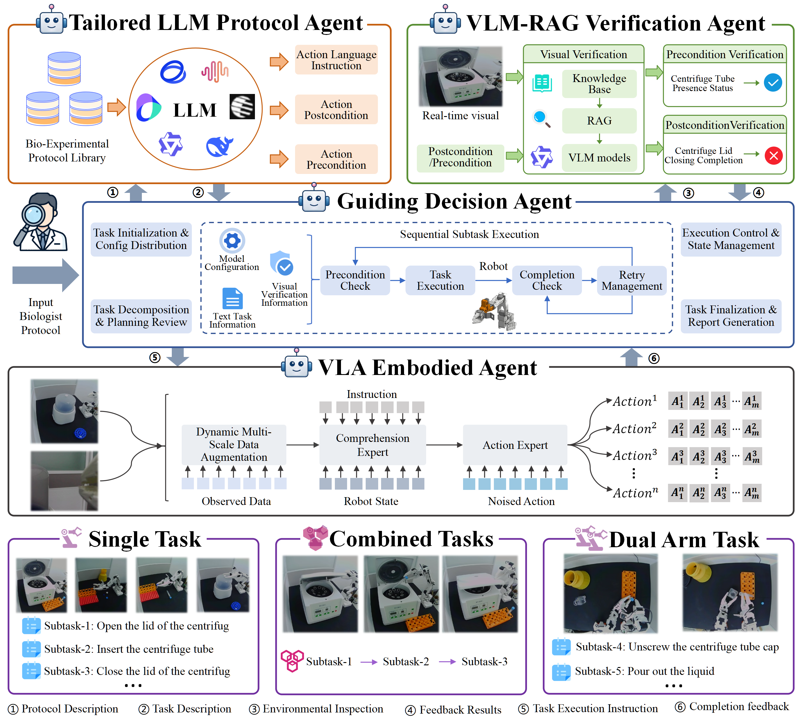
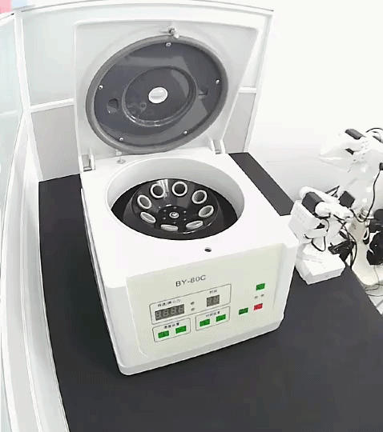
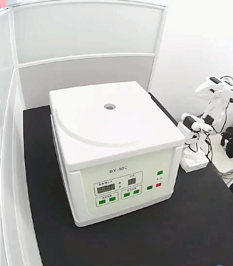
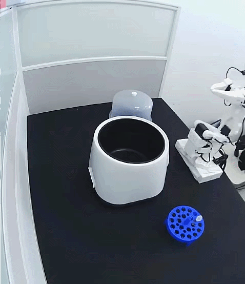
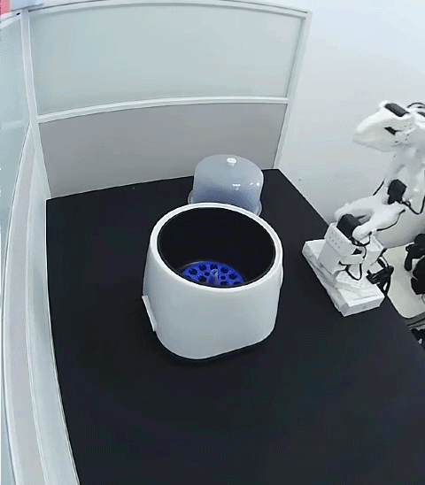

# BioProVLA-Agent

An Affordable, Protocol-Driven, Vision-Enhanced VLA-Enabled Embodied Multi-Agent System with Closed-Loop-Capable Reasoning for Biological Laboratory Manipulation

## 🤖 1. Example

### 🗓️ 1.1 Single Task

|  |  |  |  |
| :----------------------------------------------------------: | ------------------------------------------------------------ | ------------------------------------------------------------ | ------------------------------------------------------------ |
|  |  |  |  |
|  |  |  |  |

### 🗓️ 1.2 Double Task

|  |  |  |
| ------------------------------------------------------------ | ------------------------------------------------------------ | ------------------------------------------------------------ |

### 🗓️ 1.3 Composite Task

| [Loading centrifuge tube](./assets/videos/single_arm_1.mp4)  | [Unload centrifuge tube](./assets/videos/single_arm_2.mp4) | [Tidy up the desktop](./assets/videos/single_arm_3.mp4)  |
| ------------------------------------------------------------ | ---------------------------------------------------------- | -------------------------------------------------------- |
| **[Clean up waste materials](./assets/videos/single_arm_4.mp4)** | **[Loading float](./assets/videos/single_arm_5.mp4)**      | **[Unload the float](./assets/videos/single_arm_6.mp4)** |
| **[Pour Waste Liquid](./assets/videos/double_arm_1.mp4)**    |                                                            |                                                          |

